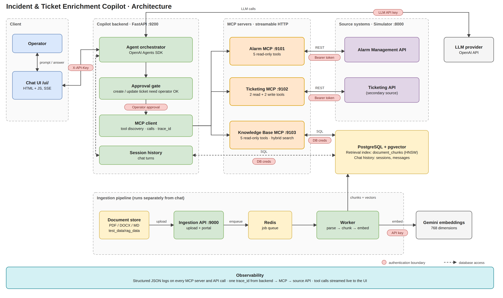
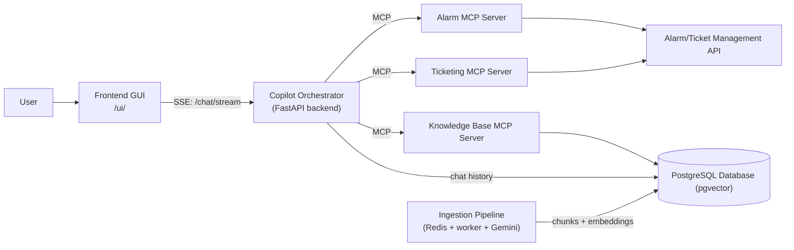

# High-Level Architecture Document: Incident & Ticket Enrichment Copilot

## 1. System Overview

The Incident & Ticket Enrichment Copilot assists plant operators in investigating alarms, referencing troubleshooting procedures, and drafting support tickets through a natural language interface. 

The architecture separates user interaction, intelligent orchestration, tool execution via three dedicated Model Context Protocol (MCP) servers, and downstream data/persistence systems.

---

## 2. Architecture Diagram

Editable source: [architecture-diagram.drawio](architecture-diagram.drawio) (open in [diagrams.net](https://app.diagrams.net)). Simplified view:

---

## 3. Core Components

### 3.1 User
* Interacts with the system through natural language queries (e.g., checking active alarms, requesting troubleshooting steps, or asking to draft an incident).
* Reviews generated ticket drafts and explicitly confirms any write operations.

### 3.2 Frontend GUI
* Provides a chat interface for operator interactions.
* Displays structured outputs including alarm details, draft ticket previews, and document citations.
* Prompts the operator for explicit confirmation before any ticket creation action is executed.

### 3.3 Copilot Orchestrator
* Serves as the central reasoning and decision-making engine.
* Interprets user intent and decides which tools to call across the three MCP servers.
* Directly connects to the **PostgreSQL Database** to store and retrieve conversational **Chat History** for multi-turn session context.
* Coordinates multi-step tool execution (retrieving alarms, finding documentation, checking past tickets).
* Combines structured telemetry data and unstructured documentation into grounded responses with citations.

### 3.4 Alarm MCP Server
* Exposes alarm tools to the Copilot: asset search, alarm telemetry retrieval, summaries, priority scores, and operator recommendations.
* Connects directly to the **Alarm Management API**.

### 3.5 Alarm/Ticket Management API
* Backend source system providing real-time and historical plant telemetry, asset hierarchy, alarm states, and analytical calculations. And for 
  incident management, handling ticket search, creation, and persistence.
  
### 3.6 Ticketing MCP Server
* Exposes tools related to incident ticket management to the Copilot.
* Connects directly to the **Ticketing API**:
  * Executes tools for searching similar past tickets.
  * Executes tools for creating new incident tickets.

### 3.7 Knowledge Base MCP Server
* Exposes read-only tools for retrieving troubleshooting guides, standard operating procedures (SOPs), and manuals.
* Connects directly to the **PostgreSQL Database (pgvector)** to run similarity searches over the **Vectors**.

### 3.8 PostgreSQL Database (pgvector)
* Central persistence layer serving two distinct responsibilities:
  1. **Chat History**: Directly accessed by the Copilot Orchestrator to persist conversational messages and session context.
  2. **Vectors**: Written by the Ingestion Pipeline and queried by the Knowledge Base MCP Server for semantic search via the `pgvector` extension.

### 3.9 Ingestion Pipeline
* Prepares the knowledge base. It runs separately from the chat flow.
* Parses and chunks documents, embeds them with Gemini (jobs are queued through Redis and handled by a worker), and writes the chunks and embeddings to the PostgreSQL Database (pgvector).
* See [`ingestion/README.md`](../ingestion/README.md) for details.

---

## 4. End-to-End Interaction Flow

> **Prerequisite**: SOPs and troubleshooting guides are ingested beforehand by the **Ingestion Pipeline**.

1. **Request & Session Context**: The User enters a request into the Frontend GUI (e.g., *"Prepare an incident for the highest-priority active alarm in EastRefinery"*). The Copilot Orchestrator records and retrieves previous session turns via its **Chat History** connection to the **PostgreSQL Database**.
2. **Orchestration**: The Copilot Orchestrator identifies the required steps and coordinates tool execution:
   * Calls **Alarm MCP Server** to query the **Alarm Management API** for active alarms, asset details, and priority scoring.
   * Calls **Knowledge Base MCP Server** to query **Vectors** in the **PostgreSQL Database (pgvector)** for relevant troubleshooting procedures and SOPs.
   * Calls **Ticketing MCP Server** to search the **Ticketing API** for similar historical tickets.
3. **Draft & Review**: The Copilot synthesizes the gathered context into a structured incident draft with source citations and presents it to the User via the Frontend GUI.
4. **Confirmation & Creation**: The User reviews the draft and approves ticket creation. The Copilot calls the **Ticketing MCP Server**, which invokes the **Ticketing API** to create the ticket and returns the confirmation to the User.
